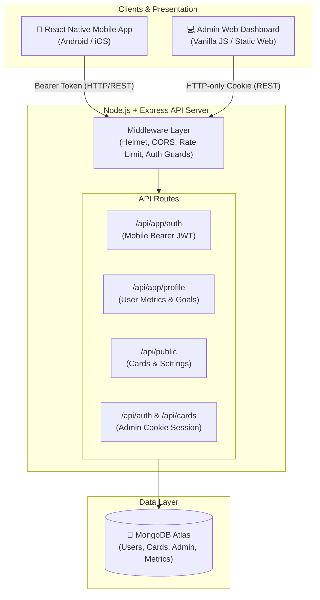

# 🏋️‍♂️ WorkOut-App

<div align="center">


[](https://reactnative.dev/)
[](https://www.typescriptlang.org/)
[](https://nodejs.org/)
[](https://expressjs.com/)
[](https://www.mongodb.com/)
[](LICENSE)
[](CONTRIBUTING.md)

<p align="center">
  A full-stack, personalized mobile fitness and workout tracking ecosystem featuring a high-performance <b>React Native (TypeScript)</b> mobile application, a resilient <b>Node.js/Express</b> RESTful backend, and an integrated <b>Admin Management Portal</b> for workout card curation and platform analytics.
</p>

<p align="center">
  🌐 <b>Live Deployed Backend & Admin Portal:</b> <a href="https://workout-app-g3ag.onrender.com" target="_blank"><code>https://workout-app-g3ag.onrender.com</code></a>
</p>

[Live Demo](https://workout-app-g3ag.onrender.com) •
[Explore Features](#-key-features) •
[Architecture](#-system-architecture) •
[Quick Start](#-getting-started) •
[API Reference](#-api-endpoints-summary) •
[Deployment Guide](#-production-deployment)

---

</div>

## 📑 Table of Contents

- [Overview](#-overview)
- [Key Features](#-key-features)
  - [Mobile App (User Experience)](#-mobile-app-user-experience)
  - [Backend & Security](#-backend--security)
  - [Web Admin Dashboard](#-web-admin-dashboard)
- [System Architecture](#-system-architecture)
- [Tech Stack](#-tech-stack)
- [Project Structure](#-project-structure)
- [Getting Started](#-getting-started)
  - [Prerequisites](#prerequisites)
  - [1. Backend Setup](#1-backend-setup)
  - [2. Mobile App Setup](#2-mobile-app-setup)
  - [3. Device & Emulator Networking](#3-device--emulator-networking)
- [Environment Configuration](#-environment-configuration)
- [API Endpoints Summary](#-api-endpoints-summary)
- [Production Deployment](#-production-deployment)
- [Contributing & License](#-contributing--license)

---

## 🌟 Overview

**WorkOut-App** is engineered to bridge the gap between workout content management and everyday fitness tracking. Users enjoy a tailor-made mobile experience with onboarding quizzes, goal setting, routine tracking, calendar scheduling, and analytical reporting. Meanwhile, trainers and administrators have access to a secure, lightweight web dashboard to manage video libraries, feature cards, and monitor system health.

---

## ✨ Key Features

### 📱 Mobile App (User Experience)
* **Personalized Onboarding**: Guides new users through goal setting (e.g., *build muscle*, *stay fit*, *lose weight*), body composition inputs (height, weight, age), and gender selection.
* **Smart Workout Discovery**: Browse workouts by body targets, difficulty levels, and featured highlights powered by dynamic backend card feeds.
* **Active Workout Player & Tracking**: Real-time workout execution with exercise intervals, sets, reps, and completion logging.
* **Interactive Workout Calendar**: Schedule routines and view completed sessions using high-performance visual calendar widgets (`react-native-calendars`).
* **Analytics & Performance Tracking**: Visual feedback on consistency, workout frequency, and fitness achievements.
* **Persistent Authentication**: Seamless token-based authentication with `AsyncStorage` and automatic token renewal.
* **Adaptive Theming**: Consistent design system supporting dark and light themes with responsive UI scaling.

### 🛡️ Backend & Security
* **Dual-Tier Authentication**:
  * **Admin Flow**: Cookie-based JWT authentication with strict HTTP-only cookies and CSRF safeguards.
  * **Mobile App Flow**: Bearer token JWT architecture with user registration, login, and profile update endpoints.
* **Robust Defense in Depth**:
  * Request rate limiting with `express-rate-limit` against brute-force attacks on auth endpoints.
  * Security headers via `helmet` and fine-grained CORS isolation.
  * Request validation and sanitization using `express-validator`.
  * Passwords hashed using industry-standard `bcryptjs`.
* **Database & Seeding**: Automated database seeding scripts for initializing admin credentials and default workout libraries.

### 💻 Web Admin Dashboard
* **Content Management**: Create, edit, publish, feature, and reorder video exercise cards with instant preview.
* **Real-time Overview**: Platform statistics, content counts, and health metrics (`/api/health`).
* **Settings Management**: Configurable platform settings, branding, and social link integrations.
* **Zero-Build Web UI**: Fast, responsive admin console served directly via Express static routing.

---

## 🏗 System Architecture



---

## 🛠 Tech Stack

| Layer | Technologies |
| :--- | :--- |
| **Mobile Client** | [React Native 0.87](https://reactnative.dev/), [React 19](https://react.dev/), [TypeScript 6](https://www.typescriptlang.org/), [React Navigation 7](https://reactnavigation.org/), [Axios](https://axios-http.com/), [AsyncStorage](https://react-native-async-storage.github.io/async-storage/), [React Native Calendars](https://github.com/wix/react-native-calendars) |
| **Backend API** | [Node.js](https://nodejs.org/), [Express.js 4](https://expressjs.com/), [Mongoose 8](https://mongoosejs.com/), [JWT (jsonwebtoken)](https://github.com/auth0/node-jsonwebtoken), [bcryptjs](https://github.com/dcodeIO/bcrypt.js) |
| **Security & Utilities** | [Helmet](https://helmetjs.github.io/), [CORS](https://github.com/expressjs/cors), [Express Rate Limit](https://express-rate-limit.mintlify.app/), [Express Validator](https://express-validator.github.io/docs/), [Morgan](https://github.com/expressjs/morgan) |
| **Database** | [MongoDB](https://www.mongodb.com/) / [MongoDB Atlas](https://www.mongodb.com/atlas) |
| **Admin UI** | HTML5, CSS3, Modern ES6+ JavaScript (Served by Express) |

---

## 📁 Project Structure

```text
WorkOut-App/
├── Backend/                       # Express REST API & Admin Portal
│   ├── config/                    # Database connection (Mongoose)
│   ├── controllers/               # Route business logic (auth, cards, dashboard, profile)
│   ├── middleware/                # Auth guards, validation, error handlers
│   ├── models/                    # Mongoose schemas (User, Admin, Card, Setting)
│   ├── public/                    # Admin dashboard static assets (HTML/CSS/JS)
│   ├── routes/                    # API route definitions
│   ├── seed/                      # DB initializers (seedAdmin.js, seedCards.js)
│   ├── utils/                     # Helper routines & formatters
│   ├── package.json
│   ├── server.js                  # Express application entrypoint
│   └── .env.example               # Template for environment variables
│
├── Frontend/                      # React Native Mobile Application
│   ├── android/                   # Native Android configuration & Gradle files
│   ├── ios/                       # Native iOS project & CocoaPods configuration
│   ├── src/
│   │   ├── api/                   # Axios client, auth helpers, endpoints config
│   │   ├── assets/                # App artwork, illustrations, icons
│   │   ├── components/            # Reusable UI elements (Cards, TabBar, Header)
│   │   ├── context/               # Global state (AuthContext)
│   │   ├── data/                  # Static workouts & sample datasets
│   │   ├── navigation/            # Navigation stacks & Bottom Tab navigator
│   │   ├── pages/                 # App views (Home, Workout, Calendar, Analysis, Auth, Profile)
│   │   ├── theme/                 # Design tokens (colors, typography, responsive utils)
│   │   └── utils/                 # Onboarding helpers & validators
│   ├── App.tsx                    # Root React Native component
│   ├── package.json
│   └── tsconfig.json
└── README.md
```

---

## 🚀 Getting Started

### Prerequisites

* **Node.js**: `v18.0.0` or higher (recommended: Node LTS)
* **Package Manager**: `npm` or `yarn`
* **MongoDB**: A running local MongoDB instance or a free [MongoDB Atlas](https://www.mongodb.com/cloud/atlas) cluster URI.
* **Mobile Toolchain**:
  * [React Native CLI Environment Setup](https://reactnative.dev/docs/environment-setup)
  * **Android**: Android Studio with Android SDK & emulator (or connected device with USB debugging).
  * **iOS** (macOS only): Xcode and CocoaPods (`cd Frontend/ios && pod install`).

---

### 1. Backend Setup

1. **Navigate to the Backend directory**:
   ```bash
   cd Backend
   ```

2. **Install dependencies**:
   ```bash
   npm install
   ```

3. **Configure Environment Variables**:
   Copy the example environment file and fill in your values:
   ```bash
   cp .env.example .env
   ```
   *(See [Environment Configuration](#-environment-configuration) below for details).*

4. **Seed Initial Database**:
   Create the initial admin user and sample workout cards:
   ```bash
   npm run seed          # Creates default administrator
   npm run seed:cards    # Loads default workout library
   ```

5. **Start the Development Server**:
   ```bash
   npm run dev
   ```
   The backend will be live at `http://localhost:5001`. You can visit this URL in your browser to inspect the **Admin Dashboard**!

---

### 2. Mobile App Setup

1. **Navigate to the Frontend directory**:
   ```bash
   cd Frontend
   ```

2. **Install dependencies**:
   ```bash
   npm install
   ```

3. **iOS CocoaPods Installation** *(macOS only)*:
   ```bash
   cd ios && pod install && cd ..
   ```

4. **Verify API Base URL**:
   Ensure `Frontend/src/api/config.ts` aligns with your runtime device (see networking section below).

5. **Start Metro Bundler**:
   ```bash
   npm start
   ```

6. **Launch the Application**:
   * **Android**:
     ```bash
     npm run android
     ```
   * **iOS**:
     ```bash
     npm run ios
     ```

---

### 3. Device & Emulator Networking

When developing locally, ensure the mobile app targets the correct host:

| Platform | Configuration (`Frontend/src/api/config.ts`) | Note |
| :--- | :--- | :--- |
| **Android Emulator** | `http://10.0.2.2:5001/api` | `10.0.2.2` maps to `localhost` on the host machine |
| **iOS Simulator** | `http://localhost:5001/api` | Shares network stack with macOS |
| **Physical Phone** | `http://<YOUR_LOCAL_IP>:5001/api` | e.g. `http://192.168.1.100:5001/api` (phone & computer on same Wi-Fi) |
| **Production Server** | `https://your-api.onrender.com/api` | Live deployed cloud backend |

---

## ⚙️ Environment Configuration

Create a `.env` file in the `Backend/` folder with the following variables:

```env
# Server Runtime
NODE_ENV=development
PORT=5001

# Database
MONGODB_URI=mongodb+srv://<username>:<password>@cluster0.example.mongodb.net/workout_db?retryWrites=true&w=majority

# Authentication & Security
JWT_SECRET=super_secret_jwt_key_replace_in_production
JWT_EXPIRES_IN=7d
COOKIE_SECURE=false

# Allowed Client Origin (for CORS)
CLIENT_URL=http://localhost:5001

# Initial Administrator Credentials (used during seed)
ADMIN_EMAIL=admin@example.com
ADMIN_PASSWORD=change-this-password
```

> [!IMPORTANT]
> When deploying to production with HTTPS, always set `COOKIE_SECURE=true` and provide a cryptographically strong `JWT_SECRET`.

---

## 📡 API Endpoints Summary

### Mobile App Authentication & User
| Method | Endpoint | Description | Auth Required |
| :--- | :--- | :--- | :--- |
| `POST` | `/api/app/auth/register` | Register new mobile app user | No |
| `POST` | `/api/app/auth/login` | Log in and receive Bearer JWT | No |
| `GET` | `/api/app/auth/me` | Fetch active user profile | Bearer Token |
| `PUT` | `/api/app/profile` | Update fitness goals & body stats | Bearer Token |

### Public & Discovery
| Method | Endpoint | Description | Auth Required |
| :--- | :--- | :--- | :--- |
| `GET` | `/api/public/cards` | Fetch published exercise cards | No |
| `GET` | `/api/public/cards/:id` | Fetch specific card details | No |
| `GET` | `/api/public/settings` | Retrieve public platform branding | No |
| `GET` | `/api/health` | Service uptime and status check | No |

### Admin & Content Management
| Method | Endpoint | Description | Auth Required |
| :--- | :--- | :--- | :--- |
| `POST` | `/api/auth/login` | Admin login (sets HTTP-only cookie) | No |
| `GET` | `/api/auth/me` | Get admin session | Admin Cookie |
| `GET` | `/api/dashboard/stats` | High-level metrics & counts | Admin Cookie |
| `GET` | `/api/cards` | Paginated search & filter of all cards | Admin Cookie |
| `POST` | `/api/cards` | Create new workout card | Admin Cookie |
| `PUT` | `/api/cards/:id` | Update existing card | Admin Cookie |
| `DELETE` | `/api/cards/:id` | Delete card | Admin Cookie |
| `PATCH` | `/api/cards/reorder` | Update card display order | Admin Cookie |

---

## 🌐 Production Deployment

### Backend Service (Render / Railway / Fly.io)

1. Connect your repository: `Mahesh-4017/WorkOut-App`.
2. Configure settings:
   * **Root Directory**: `Backend`
   * **Runtime**: `Node`
   * **Build Command**: `npm install`
   * **Start Command**: `npm start`
   * **Health Check Path**: `/api/health`
3. Add Environment Variables (from your `.env`):
   * `NODE_ENV=production`
   * `MONGODB_URI=<your-atlas-uri>`
   * `JWT_SECRET=<strong-random-key>`
   * `COOKIE_SECURE=true`
   * `CLIENT_URL=<your-frontend-or-app-url>`
4. In **MongoDB Atlas**, add `0.0.0.0/0` under **Network Access** to allow cloud backend traffic.
5. In the platform console/shell, execute `npm run seed` once to initialize your admin user.

---

## 🤝 Contributing & License

Contributions, issues, and feature suggestions are welcome!

1. Fork the project
2. Create your feature branch (`git checkout -b feature/AmazingFeature`)
3. Commit your changes (`git commit -m 'feat: add amazing feature'`)
4. Push to the branch (`git push origin feature/AmazingFeature`)
5. Open a Pull Request

Distributed under the **MIT License**. See `LICENSE` for more information.

<div align="center">
  <sub>Built with ❤️ for fitness enthusiasts and developers worldwide.</sub>
</div>
